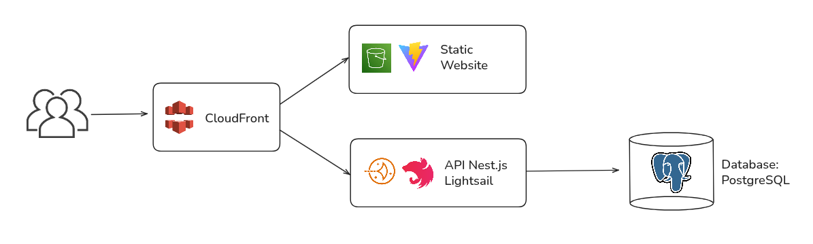

# ⚙️ Tecnologias

## 🗓 Informações Gerais

* **Nome do Projeto:**
  Plataforma Web com Frontend Estático e API em Lightsail

* **Tech Lead:**
  Jonathan Alves

* **Data de Entrada na Área:**
  25/08/2025

* **Data Estimada de Conclusão da Área:**
  30/09/2025

* **Link para Documento de Visão de Produto:**
  TBD (ex.: [https://github.com/empresa/docs/projeto/visao.md](https://github.com/empresa/docs/projeto/visao.md))

## Checklist de Entrada e Saída da Área de Tecnologia

### ✅ Checklist de Entrada

* [x] Documento de Visão de Produto validado

### 📤 Checklist de Saída

* [ ] Stack definida e aprovada
* [ ] Diagrama de arquitetura completo
* [ ] Plano de implantação claro
* [ ] Documento validado com o time de Desenvolvimento

## Stack Tecnológica

### Frontend

* Framework/Biblioteca: React + Vite
* Linguagem principal: Typescript
* Ferramentas adicionais: Tailwind, ESLint, Prettier
* Hospedagem: **Amazon S3** (static website) + **CloudFront** (CDN)
* Domínio: **Route 53** + **ACM** (certificado SSL)
* Justificativa da escolha:

  * Build estático rápido e barato via S3; distribuição global com baixa latência via CloudFront; domínio e SSL gerenciados pela AWS.

### Backend

* Linguagem: Typescript
* Framework: Nest.js
* Execução: **Amazon Lightsail** (instância ou **Lightsail Containers**)
* ORM: Prisma
* Estratégia de autenticação/autorização: JWT (Access + Refresh opcional)
* Armazenamento de arquivos (se necessário): S3
* Justificativa da escolha:

  * NestJS oferece arquitetura modular, validação e DI. Lightsail simplifica custo/gestão mantendo acesso ao ecossistema AWS.

### Banco de Dados

* Tipo (relacional/não-relacional): Relacional
* Tecnologia: **PostgreSQL gerenciado no Amazon Lightsail**
* Justificativa da escolha:

  * Instância gerenciada com snapshots automáticos, atualização menor custo/complexidade que RDS para este porte e integração simples com a mesma VPC do Lightsail.

### Outras Tecnologias

* Cache (ex: Redis): N/A (opcional futuro: ElastiCache/Redis)
* Fila de mensagens (ex: RabbitMQ, Kafka): N/A
* Monitoramento e logs: N/A
* Testes automatizados: N/A
* Justificativa da escolha:

## Arquitetura da Solução

### Visão Geral da Arquitetura

Aplicação SPA hospedada no S3 e servida globalmente pelo CloudFront. Usuário acessa **app.seu-dominio.com** (CloudFront), que chama a API **api.seu-dominio.com** hospedada em uma instância/serviço do **Lightsail**. A API acessa um **PostgreSQL gerenciado do Lightsail** em sub-rede privada. Domínios e DNS em **Route 53** e certificados TLS em **ACM**.

### Componentes Principais

* **Frontend (S3 + CloudFront)**: entrega de assets estáticos / SPA
* **API (Lightsail)**: NestJS; autenticação JWT; integra com S3 (uploads) e banco
* **Banco de Dados (Lightsail PostgreSQL)**: dados transacionais; snapshots automáticos
* **DNS (Route 53)**: zonas hospedadas e registros (A/AAAA/ALIAS)
* **Certificados (ACM)**: TLS para CloudFront e (opcional) para load balancer do Lightsail
* **Observabilidade**: CloudWatch Logs + Sentry

### Diagrama da Arquitetura (mermaid)

## Estrutura de Implantação

### Ambiente de Desenvolvimento

* Como os devs devem subir localmente:

  * `docker compose up -d db` (Postgres local)
  * Backend: `npm run start:dev` (Nest)
  * Frontend: `npm run dev` (Vite)

## Considerações de Segurança

* **Políticas de CORS:**

  * Permitir apenas `https://app.seu-dominio.com` (métodos GET/POST/PUT/PATCH/DELETE; credenciais desabilitadas por padrão).
* **Proteção de dados sensíveis:**

  * Trânsito: HTTPS via CloudFront/ACM; TLS 1.2+ na API.
  * Em repouso: versionamento e criptografia ativados no S3; criptografia no banco (Lightsail) habilitada.

* **Autenticação e autorização:**

  * JWT (expiração curta para access token, refresh opcional), roles/guards no NestJS; senhas com bcrypt; rotação periódica de segredos.
* **Rede e Acesso:**

  * Banco não exposto à Internet (apenas API). Security groups/portas mínimas (443/80 para CloudFront; 443/22 restrito para API).

---

### Observações

* Caso o tráfego cresça, avaliar migração gradual para **EC2 + ALB + RDS** mantendo o domínio e a CDN.
* Se for necessário WebSockets/Realtime, considerar Lightsail com Nginx reverso ou API Gateway/WebSocket.
